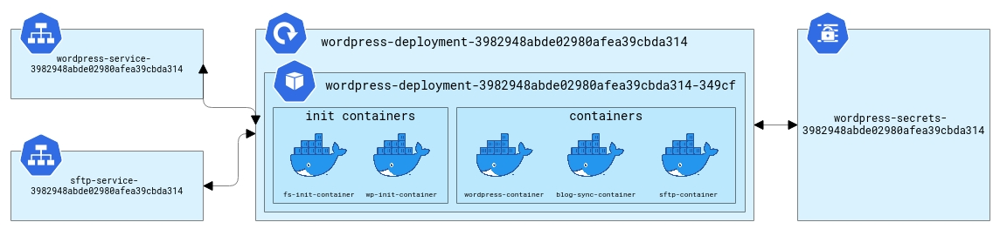

# USAGE

Edit values.yml with your informations then install it

# Install

helm install release-name mysql
helm install release-name wordpress

# Rock Stage SRE Assessment

## About Rock Stage

Currently, our product is based on a set of Kubernetes clusters with all websites hosted split on Deployments and Services. Each Deployment has one Pod with 2 init-containers and 3 containers running indefinitely. Those are managed by a custom CRD named WPSite (we won't need any details of it by now).

Here's an overview of what a WordPress website Deployment at Rock Stage looks like: 

## What you should do

- Configure a Kubernetes cluster locally (Minikube is probably the easiest way)
- Set 3 or more WordPress Kubernetes Deployments + Services
  - you don't need to follow the architecture presented above - 1 container per WordPress deployment is fine
  - use whatever ports you like (they can be set manually)
- Set a MySQL Deployment + Service
  - It should persist data even when the Pod restarts
  - Use this deployment as the WordPress deployments' database (create multiple DBs on it)
    - You'll need separate users and passwords for each deployment
    - You can use whatever way you like to set the MySQL database/user/password to be used on wordpress-container
  - Use whatever way you like to populate the MySQL instance (you can do it with a custom wordpress image on wordpress-container if you like)
- Set PHPMyAdmin for sites
  - Every site "owner" should be able to access PHPMyAdmin
  - Use the strategy you want (use your imagination)
- Set Prometheus + Grafana monitoring for the MySQL service (Bonus task - not required)

## Considerations

- You may fork this repo to do the assessment
- You can create a Markdown file to document whatever decisions you think that aren't obvious and what we should do to replicate your environment
- You have 7 days to finish the assessment (you can answer the email with the link to your repository)